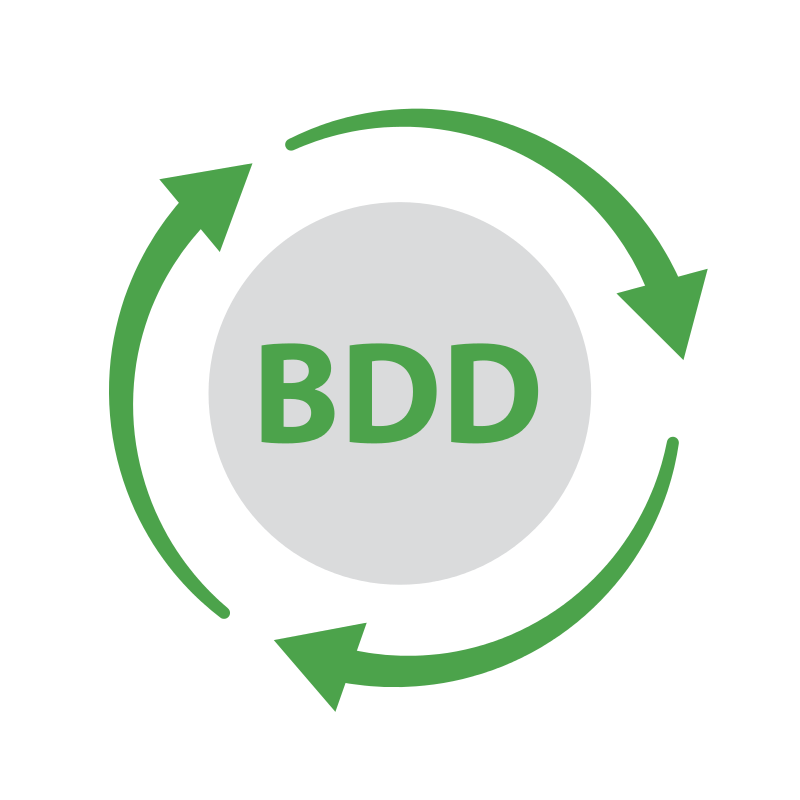
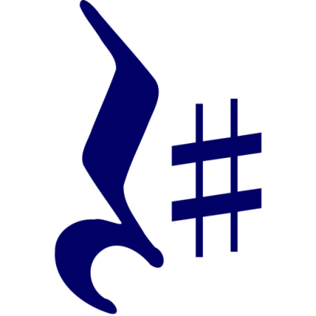

# RestApiTesting.Framework.Lynx 
This is a RESTful API testing Framework using C#, .NET Core, Xunit Gherkin Quick BDD test framework, RestSharp client library and Fluent Assertions to test JSONPlaceholder REST API.

## Xunit.Gherkin.Quick  
Xunit.Gherkin.Quick is a lightweight, cross platform BDD test framework (targets .NET Standard, can be used from both .NET and .NET Core test projects). It parses Gherkin language and executes Xunit tests corresponding to scenarios. https://github.com/ttutisani/Xunit.Gherkin.Quick

## Target framework  
.NET Core 2.1

## JSONPlaceholder  
JSONPlaceholder is a free online REST API that you can use whenever you need some fake data. It's great for tutorials, testing new libraries, sharing code examples.
https://jsonplaceholder.typicode.com/

## Routes Tested
The following HTTP methods are tested:
* GET
* POST
* PUT
* PATCH
* DELETE

## RestSharp  
Simple REST and HTTP API Client for .NET
http://restsharp.org/

## Assertions 
Fluent Assertions is used for validation.
https://fluentassertions.com/

## Integrated Development Environment
Microsoft Visual Studio IDE is used to develop this Framework.

### Build Solution
* Build => Build Solution

### Run Tests
* Test => Windows => Test Explorer => Run All

### Run Tests with Command Prompt/Windows PowerShell
* Open Folder in File Explorer: ..\RestApiTesting.Framework.Lynx\bin\Debug\netcoreapp2.1
* Open Command Prompt/Windows PowerShell
* Run "dotnet vstest RestApiTesting.Framework.Lynx.dll"
